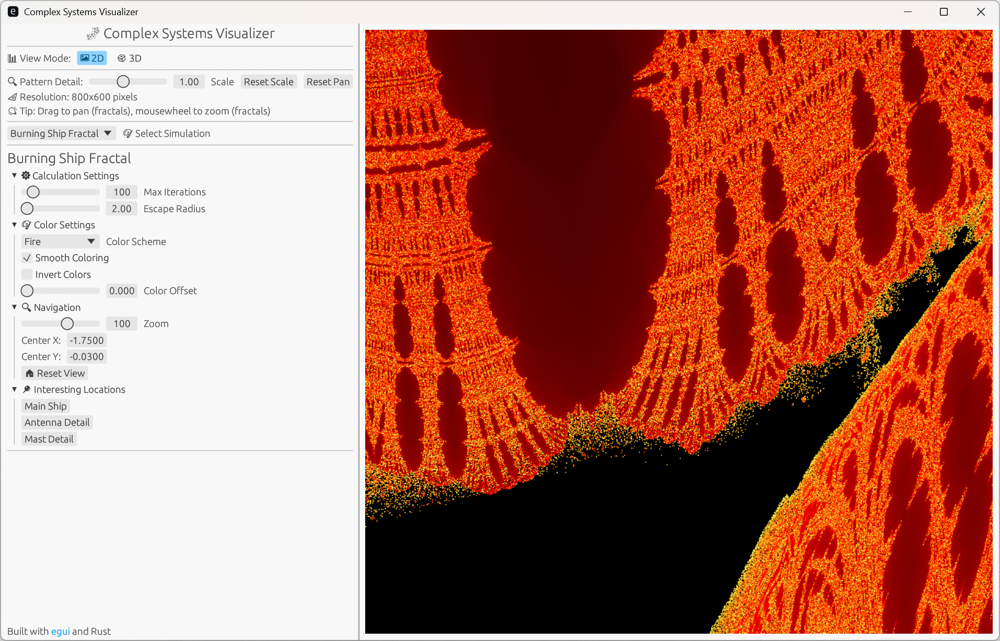

# Complex Systems Visualizer

<div align="center">
          <a href="https://complex-systems-visualizer.pages.dev/" target="_blank">
          
          </a>
      <br>
          <i>Burning Ship fractal at an interesting landmark</i>
    <br>
  </div>
<br>


A comprehensive Rust application for exploring complex systems, fractals, cellular automata, particle simulations, and emergent behavior through interactive visualizations.


## Features

**39 Unique Simulations** across 2D and 3D categories:

### 2D Simulations (22 total)
- **Fractals** (3): Mandelbrot Set, Julia Set, Burning Ship
- **Cellular Automata** (4): Game of Life, Elementary CA, Langton's Ant, Cyclic CA
- **Growth & Self-Organization** (2): DLA (Diffusion-Limited Aggregation), Sandpile
- **Physical Simulations** (4): Double Pendulum, Reaction-Diffusion, Lissajous Curves, Wave Interference
- **Generative Art** (6): Koch Snowflake, Phyllotaxis, Perlin Flow, Boids, De Jong Attractor, Clifford Attractor
- **Complex Emergent** (2): Slime Mold, Falling Sand

### 3D Simulations (17 total)
- **Visual Animations** (3): DNA Helix, Torus Knot, Galaxy Spiral
- **Particle Systems** (5): 3D Particle Attractor, 3D Boids, N-Body Gravity, Fluid SPH, Magnetic Field
- **Chaotic Attractors** (7): Lorenz, Rössler, Aizawa, Halvorsen, Dadras, Thomas, Chen
- **Advanced Effects** (3): Vortex Turbulence, Lightning Bolt, 3D Fractal Tree

### Key Features
- **Interactive Controls**: Real-time parameter adjustments with immediate visual feedback
- **Mousewheel Zoom**: Smooth zooming for fractal exploration (Mandelbrot, Julia, Burning Ship)
- **Drag-to-Pan**: Navigate fractal landscapes by dragging
- **26 Color Schemes**: Beautiful palettes for fractals and visualizations
- **Preset Configurations**: Quick access to interesting views and parameters
- **High Performance**: Parallel computation using Rayon for fast rendering
- **Professional UI**: Organized collapsible sections with emoji icons

## Architecture

The project uses a Cargo workspace structure for modularity:

```
mandlebrot-visualizer/
├── sim-core/          # Core simulation library
│   ├── src/
│   │   ├── lib.rs              # Simulation traits + color system
│   │   ├── mandelbrot.rs       # Mandelbrot fractal
│   │   ├── julia.rs            # Julia set
│   │   ├── burning_ship.rs     # Burning Ship fractal
│   │   ├── game_of_life.rs     # Conway's Game of Life
│   │   ├── cellular_automaton.rs # Elementary cellular automaton
│   │   ├── langtons_ant.rs     # Langton's Ant
│   │   ├── cyclic_ca.rs        # Cyclic cellular automaton
│   │   ├── dla.rs              # Diffusion-limited aggregation
│   │   ├── sandpile.rs         # Abelian sandpile
│   │   ├── double_pendulum.rs  # Chaotic pendulum
│   │   ├── reaction_diffusion.rs # Gray-Scott model
│   │   ├── lissajous.rs        # Lissajous curves
│   │   ├── wave_interference.rs # Wave interference patterns
│   │   ├── slime_mold.rs       # Physarum simulation
│   │   ├── falling_sand.rs     # Falling sand simulation
│   │   ├── generative/         # Generative art patterns
│   │   │   ├── mod.rs
│   │   │   ├── koch_snowflake.rs
│   │   │   ├── phyllotaxis.rs
│   │   │   ├── perlin_flow.rs
│   │   │   ├── boids.rs
│   │   │   └── strange_attractors.rs
│   │   ├── lorenz.rs           # Lorenz attractor
│   │   ├── rossler.rs          # Rössler attractor
│   │   ├── aizawa.rs           # Aizawa attractor
│   │   ├── halvorsen.rs        # Halvorsen attractor
│   │   ├── dadras.rs           # Dadras attractor
│   │   ├── thomas.rs           # Thomas attractor
│   │   ├── chen.rs             # Chen attractor
│   │   ├── dna_helix.rs        # DNA double helix
│   │   ├── torus_knot.rs       # Torus knot
│   │   ├── galaxy_spiral.rs    # Spiral galaxy
│   │   ├── particle_attractor_3d.rs # 3D particle system
│   │   ├── boids_3d.rs         # 3D flocking
│   │   ├── nbody_gravity.rs    # N-body gravitational simulation
│   │   ├── fluid_sph.rs        # SPH fluid dynamics
│   │   ├── magnetic_field.rs   # Magnetic field visualization
│   │   ├── vortex_turbulence.rs # Turbulent vortex flow
│   │   ├── lightning_bolt.rs   # Lightning generation
│   │   └── fractal_tree_3d.rs  # 3D fractal tree
│   └── Cargo.toml
│
├── sim-app/           # GUI application
│   ├── src/
│   │   ├── main.rs             # Application entry point
│   │   ├── viewer_2d.rs        # 2D visualization renderer
│   │   └── viewer_3d.rs        # 3D visualization renderer
│   └── Cargo.toml
│
├── sim-web/           # WebAssembly build for browsers
│   ├── src/
│   │   └── lib.rs              # WASM entry point
│   ├── index.html              # Web template
│   ├── Trunk.toml              # Trunk bundler config
│   └── Cargo.toml
│
├── scripts/           # Build automation
│   ├── build-web.sh            # Unix/macOS web build script
│   └── build-web.ps1           # Windows web build script
│
└── Cargo.toml         # Workspace configuration
```

## Getting Started

### Prerequisites

- [Rust](https://www.rust-lang.org/tools/install) (1.70 or later)
- Cargo (comes with Rust)

### Building & Running

```bash
# Clone the repository
git clone <repository-url>
cd mandlebrot-visualizer

# Run the application (recommended for best performance)
cargo run --release

# Or for development (faster compilation, slower runtime)
cargo run
```

### Web Build (WASM)

Run the application in your browser using WebAssembly:

#### Prerequisites

Install [Trunk](https://trunkrs.dev/), the WASM bundler:

```bash
cargo install trunk
```

Add the WebAssembly target:

```bash
rustup target add wasm32-unknown-unknown
```

#### Option 1: Using Build Scripts

```bash
# Unix/macOS/Linux
./scripts/build-web.sh

# Windows (PowerShell)
.\scripts\build-web.ps1
```

The compiled files will be in `sim-web/dist/`.

#### Option 2: Using Trunk Directly

```bash
cd sim-web

# Development server with hot reload
trunk serve

# Production build
trunk build --release
```

#### Option 3: Development Server

For local development with live reload:

```bash
cd sim-web
trunk serve --open
```

This starts a local server at `http://127.0.0.1:8080` and opens it in your browser.

#### Serving the Built Files

After building, serve the `sim-web/dist/` directory with any static file server:

```bash
# Using Python
cd sim-web/dist && python -m http.server 8080

# Using Node.js (npx)
npx serve sim-web/dist

# Using Rust's simple-http-server
cargo install simple-http-server
simple-http-server sim-web/dist
```

## Usage

### Basic Controls

1. **Select View Mode**: Choose between 2D and 3D simulations
2. **Choose Simulation**: Use the dropdown menu to select which simulation to run
3. **Adjust Parameters**: Use sliders and controls in the side panel
4. **Explore Presets**: Click preset buttons for interesting configurations

### Fractal Controls

- **Mousewheel**: Zoom in/out on fractals (Mandelbrot, Julia, Burning Ship)
- **Drag**: Pan around the fractal when zoomed in
- **Zoom Slider**: Fine control over zoom level (0.1x to 10,000x)
- **Color Schemes**: Choose from 26 beautiful color palettes

### 3D Controls

- **Rotation Sliders**: Change viewing angle (X and Y rotation)
- **Zoom Slider**: Adjust 3D perspective (0.5x to 5x)
- **Mousewheel**: Quick zoom adjustment when hovering over 3D view
- **Auto-Rotate**: Enable automatic rotation for continuous viewing

## Technology Stack

- **[Rust](https://www.rust-lang.org/)** - Systems programming language
- **[egui](https://github.com/emilk/egui)** - Immediate mode GUI library
- **[eframe](https://github.com/emilk/egui/tree/master/crates/eframe)** - Application framework (native + web)
- **[rayon](https://github.com/rayon-rs/rayon)** - Data parallelism for performance
- **[num-complex](https://github.com/rust-num/num-complex)** - Complex number arithmetic
- **[noise](https://github.com/Razaekel/noise-rs)** - Perlin noise generation
- **[wasm-bindgen](https://github.com/rustwasm/wasm-bindgen)** - Rust/JavaScript interop for WebAssembly
- **[Trunk](https://trunkrs.dev/)** - WASM web application bundler

## Documentation

- **[QUICKSTART.md](QUICKSTART.md)** - Quick start guide for new users
- **[FEATURES.md](FEATURES.md)** - Detailed feature documentation and tips

## Highlights

### Advanced Fractal Features
- 26 color schemes with smooth coloring
- Zoom up to 10,000x for deep exploration
- Generalized Mandelbrot/Julia sets (powers 2-8)
- Color cycling animations
- Preset locations for quick navigation

### Cellular Automata
- Game of Life with 6 rule variations
- 7 classic patterns (Glider Gun, Pulsar, etc.)
- Cell age visualization
- Real-time rule switching

### Physical Simulations
- Reaction-Diffusion (Gray-Scott model)
- N-Body gravity with orbital mechanics
- SPH fluid dynamics
- Magnetic field particle interactions

### Generative Art
- Boids flocking (2D and 3D)
- Perlin noise flow fields
- Strange attractors (De Jong, Clifford)
- Phyllotaxis patterns
- Koch snowflake fractals

## License

This project is licensed under the MIT License.

## Acknowledgments

- Built with the excellent Rust ecosystem
- Thanks to the egui community for the amazing GUI framework
